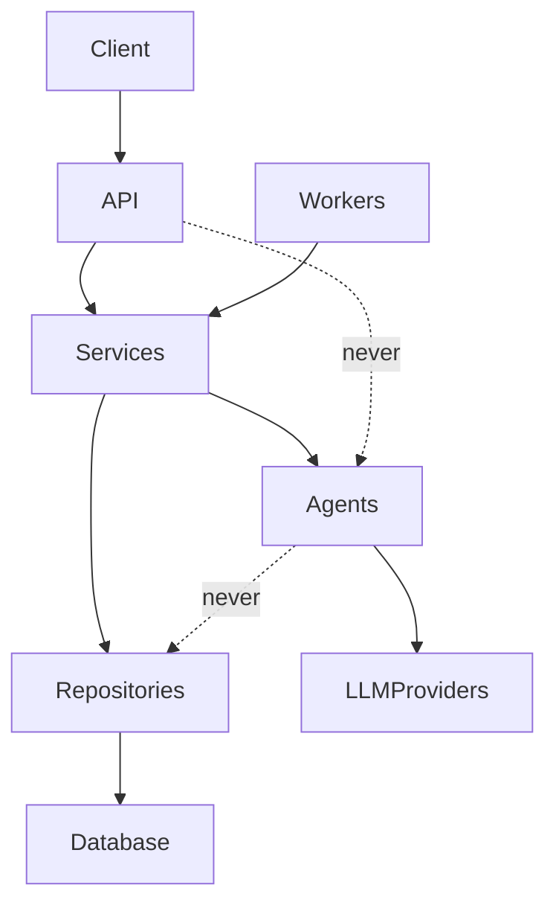
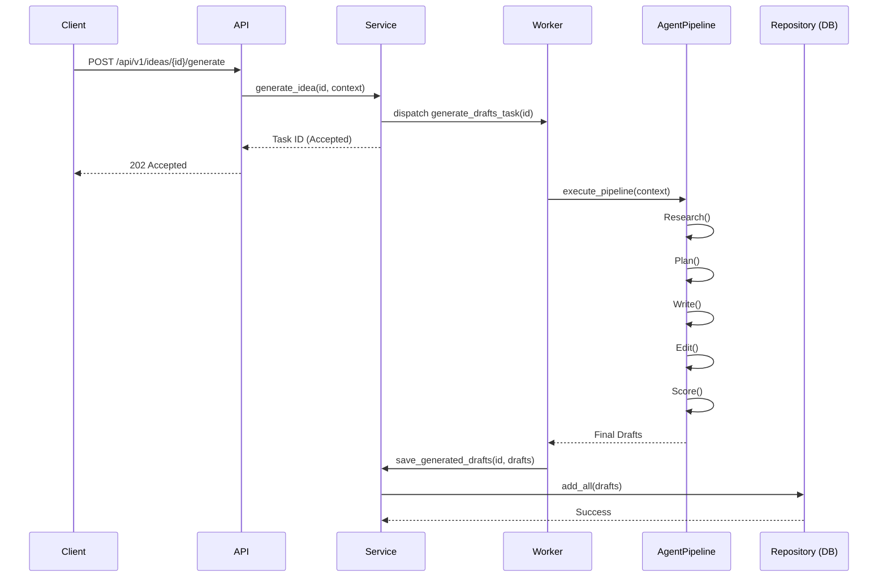

# Social Engine Architecture

This document provides an exhaustive, technically rich overview of the `social-engine` system architecture. It outlines how every layer connects, the design decisions made, and guidelines for extending the system.

---

## 1. System Overview

At a high level, `social-engine` is a production-grade AI social media automation platform. It autonomously researches topics, generates highly engaging social media content, scores the content against quality metrics, and schedules it for publication across multiple social networks. Furthermore, it learns over time using historical performance data.

### Why Clean Architecture?

Clean Architecture was chosen to decouple the core business and AI logic from external concerns (like the database, web framework, or third-party APIs). This approach guarantees that:
- **Testability:** Core business rules can be tested without the UI, database, or external servers.
- **Independence of UI/Frameworks:** FastAPI can be swapped or upgraded without affecting the domain layer.
- **Independence of Database:** SQLAlchemy models are abstracted behind repositories, allowing for easier schema migrations or database engine switches.
- **Independence of External Agents:** AI and social providers are hidden behind abstract interfaces.

### SOLID Principles Applied

- **Single Responsibility Principle (SRP):** Each layer and class has one reason to change. E.g., `ResearchAgent` only performs research; it does not touch the database.
- **Open/Closed Principle (OCP):** New LLM providers, social networks, and research plugins can be added by creating new classes without modifying existing code.
- **Liskov Substitution Principle (LSP):** Any implementation of `LLMProvider` or `SocialProvider` can be used interchangeably.
- **Interface Segregation Principle (ISP):** Distinct interfaces for different concerns (e.g., `LLMProvider` vs `SocialProvider`) keep contracts small and focused.
- **Dependency Inversion Principle (DIP):** High-level modules (Services) do not depend on low-level modules (Repositories, Agents). Both depend on abstractions (Interfaces).

---

## 2. Layered Architecture

The system is strictly divided into functional layers. To maintain Clean Architecture, cross-layer dependencies must flow inwards (towards the domain).

- **API Layer (`api/`):** Handles HTTP requests, authentication, and Pydantic validation. **Rule:** No business logic, no database queries, no direct AI calls. It strictly invokes the Service Layer.
- **Service Layer (`services/`):** Contains the core business logic and orchestration. It coordinates between repositories and agents. **Rule:** No HTTP concepts (e.g., `Request` objects), no database session management directly inside business logic (uses repositories).
- **Repository Layer (`repositories/`):** Encapsulates database access. Constructs queries using SQLAlchemy 2.0 (`select()`, not `query()`). **Rule:** Returns domain models, does not contain business logic.
- **Agent Layer (`agents/`):** Encapsulates AI-driven logic. **Rule:** Agents interact with LLM providers only. They never import from repositories or API layers. They receive data from and return data to the Service layer.
- **Worker/Task Layer (`workers/`):** Handles asynchronous job execution (e.g., Dramatiq tasks) to offload heavy agent workflows and scheduling from the API layer.

---

## 3. Request Lifecycle

The system utilizes an asynchronous, event-driven request lifecycle for heavy tasks like content generation. Below is the lifecycle of a request to generate ideas.

### Flow Breakdown:
1. **HTTP Request:** Client sends `POST /api/v1/ideas/{id}/generate`.
2. **Middleware:** Request passes through Correlation ID and JWT Auth middleware.
3. **API Endpoint:** FastAPI validates the payload and calls the `IdeaService`.
4. **Service:** `IdeaService` validates business rules and dispatches an asynchronous background task via the Worker layer. It immediately returns a HTTP 202 Accepted.
5. **Worker:** A Redis-backed worker picks up the task and initializes the Agent Pipeline.
6. **Agent Pipeline:** The pipeline orchestrates:
   - `ResearchAgent` to gather data.
   - `PlanningAgent` to outline the content.
   - `WritingAgent` to draft the post.
   - `EditingAgent` to refine.
   - `QualityAgent` to score.
7. **Persistence:** The results are passed back to the `IdeaService`, which uses the `IdeaRepository` to persist the final drafts to the PostgreSQL database.

---

## 4. Agent System Design

The agent system is designed around standardizing AI interactions into modular, composable units.

- **`BaseAgent` Abstract Class:** All agents inherit from this class, which defines an `execute(context: AgentContext) -> AgentResult` contract. This ensures every agent has a uniform interface.
- **Context and Result Contracts:** `AgentContext` encapsulates input variables, historical context, and user constraints. `AgentResult` standardizes outputs, including the generated text, metadata, and token usage statistics.
- **Dependency Injection:** Agents do not hardcode LLM SDKs. They are initialized with an `LLMProvider` interface (e.g., `def __init__(self, llm: LLMProvider)`).
- **The Pipeline:** Agents are designed to be chained. The `AgentContext` is enriched as it passes through the pipeline: Research → Planning → Writing → Editing → Quality.
- **Testability:** Because agents rely on the `LLMProvider` interface, they are fully unit-testable by injecting a `MockLLMProvider`. No actual API calls are made during CI.
- **Resilience:** All AI calls are wrapped using the `tenacity` library for automatic retries with exponential backoff on transient errors (e.g., rate limits).
- **Observability:** Token counts (prompt, completion) and latency are tracked within the `BaseAgent` and returned via `AgentResult` for billing and performance monitoring.

---

## 5. LLM Provider Abstraction

To avoid vendor lock-in, all AI models are accessed through an `LLMProvider` interface.

- **`LLMProvider` Interface:** Exposes two primary asynchronous methods:
  - `async def complete(self, prompt: str, **kwargs) -> str`
  - `async def embed(self, text: str) -> list[float]`
- **`OpenRouterProvider`:** Implements `LLMProvider` using `httpx` to route calls through OpenRouter. It handles Bearer authentication, request timeouts, and error handling.
- **Extensibility:** Adding a new provider (e.g., `AnthropicProvider`) requires implementing a single class conforming to `LLMProvider`. Zero changes are needed in the agents.
- **`MockLLMProvider`:** Used exclusively for testing. It can be pre-configured to return specific strings and tracks `call_count` and passed `prompts` for assertion checks.
- **Model Configuration:** Different agents utilize different models. For instance, the `ResearchAgent` might use an inexpensive fast model, while the `WritingAgent` uses a highly capable reasoning model (e.g., GPT-4o or Claude 3.5 Sonnet).

---

## 6. Social Provider Abstraction

Interaction with external platforms is abstracted behind the `SocialProvider` interface.

- **`SocialProvider` Interface:**
  - `publish(content: str, media: list) -> str` (Returns post ID)
  - `fetch_metrics(post_id: str) -> dict`
  - `validate_content(content: str) -> bool` (Checks length, media support, etc.)
- **`TwitterProvider`:** Uses the official Twitter API v2. Handles OAuth 2.0 token refreshes and rate limits.
- **`RedditProvider`:** Uses PRAW/asyncpraw. Targets specific subreddits, handles flairs.
- **`MockSocialProvider`:** Simulates publishing and returns a fake post ID. Used for local development and integration tests to avoid spamming real networks.
- **Extensibility:** To support LinkedIn or Bluesky, an engineer only needs to create `LinkedInProvider` implementing `SocialProvider` and register it in the dependency container.

---

## 7. Memory System (pgvector)

Long-term memory is critical for maintaining brand consistency, recalling past successful hooks, and avoiding repetitive content.

- **Table Design:** The `BrandMemory` table utilizes the `vector` extension in PostgreSQL (`vector(1536)` for OpenAI embeddings).
- **Search Mechanism:** Semantic similarity search is performed using cosine distance (`<=>` operator in SQLAlchemy).
- **Duplicate Detection:** Before saving new knowledge, a similarity search checks for existing memories with a cosine similarity > `0.85`. If found, the memory is updated rather than duplicated.
- **Pre-generation Flow:** Before the `PlanningAgent` starts, the Service Layer queries `BrandMemory` for relevant past content and injects it into the `AgentContext`.
- **Learning Agent:** Post-publishing, the `LearningAgent` analyzes performance metrics and persists high-performing patterns back into `BrandMemory` as embeddings.

---

## 8. Research Plugin System

Research is modularized via a Plugin architecture.

- **`ResearchPlugin` ABC:** Defines `async def gather(self, query: str) -> str`.
- **`ResearchPluginRegistry`:** Dynamically loads and registers plugins at startup.
- **Available Plugins:**
  - `HackerNewsPlugin`: Fetches top stories via Algolia API.
  - `RedditPlugin`: Scrapes trending posts in specific niches.
  - `RSSPlugin`: Parses standard RSS feeds.
  - `GitHubTrendingPlugin`: Scrapes trending repositories.
  - `MockPlugin`: Returns static data for tests.
- **Extensibility:** To add a new data source, create one file with a class implementing `ResearchPlugin`. The registry will automatically discover it (or it can be added to the config file).
- **Aggregation:** The `ResearchAgent` loops through all active plugins, aggregates the text, and synthesizes the data into a concise summary.

---

## 9. Database Design

The data access layer strictly utilizes **SQLAlchemy 2.0**.

- **Declarative Mappings:** Uses `Mapped[T]` and `mapped_column()` for explicit type safety and IDE support. Queries use the `select()` construct instead of the legacy `.query()`.
- **Mixins:** 
  - `UUIDMixin`: Uses UUIDv7 (or v4) for primary keys to prevent enumeration attacks and ensure uniqueness across distributed systems.
  - `TimestampMixin`: Automatically handles `created_at` and `updated_at`.
  - `SoftDeleteMixin`: Adds an `is_deleted` flag and `deleted_at` timestamp. Applied to core entities (Drafts, Ideas, Users) to prevent accidental data loss.
- **pgvector:** The `vector` column type is used seamlessly via the `pgvector` Python library.
- **Migrations:** Managed by Alembic in asynchronous mode. All schema changes are tracked in versioned migration scripts.
- **Indexing:** Indexes are heavily utilized on foreign keys, `created_at` for time-series filtering, and HNSW indexes on vector columns for fast semantic search.

---

## 10. Prompt Management

Hardcoded prompts are an anti-pattern in production AI systems.

- **Storage:** Prompts are stored as Markdown files during development but seeded into the database for production.
- **`PromptVersion` Table:** Every change to a prompt creates a new row with a version number, allowing for strict version control.
- **`PromptService`:** Agents request prompts via this service. It attempts to load the active version from the database, falling back to the local markdown file if the DB is unavailable.
- **Dashboard Integration:** A UI dashboard allows operators to tweak prompts, test them, and save them via the API, which instantly propagates to the `PromptService` without a code deployment.
- **Rollback:** If a prompt degrades quality, operators can rollback to a previous version ID via the API.

---

## 11. Quality Gate System

The `QualityAgent` acts as an automated editor and gatekeeper.

- **7-Metric Scoring:** The agent scores content across seven dimensions:
  1. `originality`
  2. `hook_strength`
  3. `engagement_predicted`
  4. `spam_probability` (lower is better)
  5. `readability_score`
  6. `brand_consistency`
  7. `human_score` (overall organic feel)
- **Thresholds:** Minimum thresholds for each metric are defined in environment variables or a settings table.
- **Auto-Reject Flow:** If the draft fails to meet the minimum threshold on any metric (e.g., `spam_probability` > 0.8), it is automatically rejected, and the Service Layer triggers a retry of the `WritingAgent` with feedback.
- **Analytics:** The `QualityScore` is stored in a related DB table. Over time, the `LearningAgent` correlates these initial scores with actual social media metrics to recalibrate the thresholds.

---

## 12. Scheduling & Worker Architecture

Background jobs and scheduled publishing are handled by Dramatiq and Redis.

- **Broker:** Redis handles the task queue.
- **Actors (Tasks):**
  - `run_research_task`: Scrapes web data.
  - `generate_drafts_task`: Orchestrates the AI pipeline.
  - `publish_task`: Pushes content to social networks.
  - `sync_analytics_task`: Pulls metrics from social networks back into the DB.
- **Resilience:** Configured with `max_retries=3` and exponential backoff for transient failures (e.g., Twitter API down). Redis persistence ensures no tasks are lost if a worker pod crashes.
- **Scheduler System:** A `PostingSchedule` table tracks when content should go live (immediate, scheduled, recurring). A lightweight scheduler polling loop runs every 60 seconds (or via cron) to enqueue `publish_task` actors for any drafts whose scheduled time has passed.

---

## 13. Security Architecture

Security is built into the system by default.

- **Authentication:** Stateless JWT authentication flow for API access.
- **Secret Management:** Absolutely no hardcoded secrets. All sensitive data is injected via environment variables. A `.env.example` file is maintained with placeholder values for onboarding.
- **Validation:** Pydantic is used extensively at the API boundary to sanitize and validate all inputs.
- **Rate Limiting:** Implemented via Redis to prevent abuse of expensive LLM-backed endpoints.
- **Data Encryption:** Social account OAuth tokens and sensitive API keys are encrypted at rest in the database using Fernet symmetric encryption.

---

## 14. Extensibility Design

The system is designed so that adding new features requires isolating changes to single files without modifying core orchestration logic.

- **New LLM Provider:** 
  - Create `providers/llm/new_provider.py`. Implement `LLMProvider`. Update the Dependency Injection container. (1 file modified).
- **New Social Platform:** 
  - Create `providers/social/new_platform.py`. Implement `SocialProvider`. (1 file modified).
- **New Research Plugin:** 
  - Create `plugins/research/new_plugin.py`. Implement `ResearchPlugin`. Add to registry config. (1 file modified).
- **New Agent:** 
  - Create `agents/new_agent.py`. Inherit from `BaseAgent`. Wire it into the pipeline within the respective Service. (1 file modified, 1 service updated).

---

## 15. Testing Strategy

A robust testing strategy guarantees stability across layers.

- **Unit Tests:** Focus on the Agent and Service layers. Agents are tested using `MockLLMProvider` to assert that they construct the correct prompts and parse the resulting JSON accurately.
- **Integration Tests:** Use Testcontainers (PostgreSQL, Redis) to test the Repository layer, verifying that SQLAlchemy `select()` queries, soft deletes, and pgvector cosine similarity searches function correctly.
- **API Tests:** Use FastAPI's `TestClient` to verify HTTP status codes, request validation, and correct invocation of mocked services.
- **Social Provider Tests:** Tested against mocked HTTP endpoints (using `respx` or `responses`) to simulate external platform behaviors, rate limits, and error codes.

---
*End of Architecture Document*
