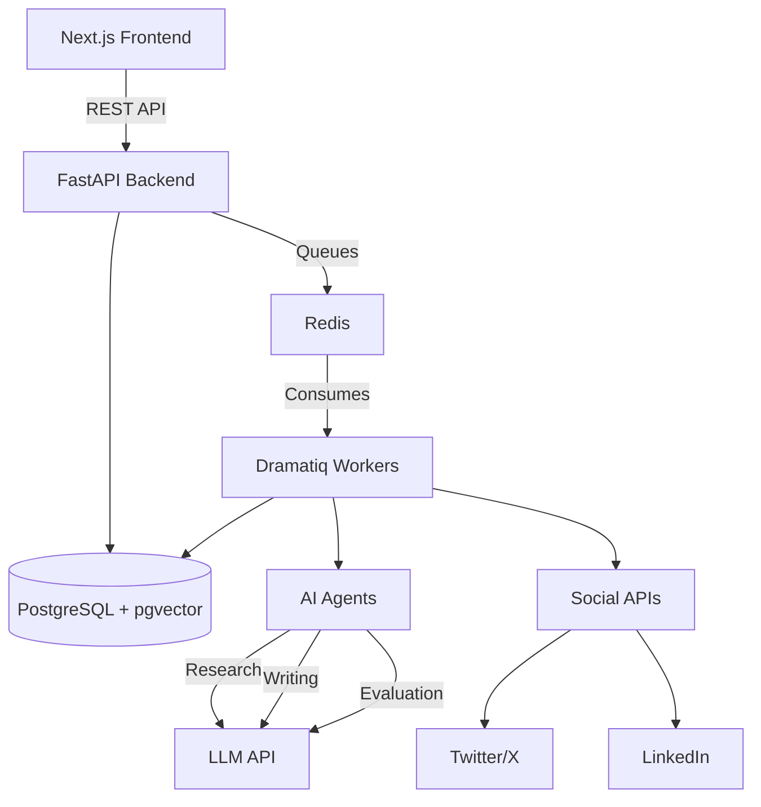

# Social Engine


**Production-grade AI social media automation platform.**

## Architecture



## Features

- 🤖 Multi-Agent System: Specialized agents for research, writing, and editing
- 📊 Advanced Analytics: Engagement tracking and performance metrics
- 🧠 Memory System: Brand voice learning and RAG using pgvector
- 📝 Draft Quality Scoring: Automated evaluation for engagement, readability, and spam
- 🗓️ Smart Scheduling: Calendar view and auto-publishing
- ⚙️ Prompt Management: Version controlled system prompts

## Quick Start

1. Clone the repository
```bash
git clone https://github.com/organization/social-engine.git
cd social-engine
```

2. Set up environment
```bash
cp .env.example .env
# Edit .env with your keys
```

3. Run with Docker
```bash
docker compose up -d
```

## Screenshots
*(Coming soon)*

## Documentation
- [Architecture Overview](docs/architecture/overview.md)
- [API Documentation](docs/api/) (Swagger at `/docs` when running)
- [Database ERD](docs/architecture/database_erd.md)

## Configuration
See `.env.example` for all configurable environment variables including LLM providers, social API keys, and database settings.

## Contributing
Please see our [Contributing Guide](CONTRIBUTING.md) for details on our code of conduct, and the process for submitting pull requests.

## License
This project is licensed under the MIT License - see the [LICENSE](LICENSE) file for details.
