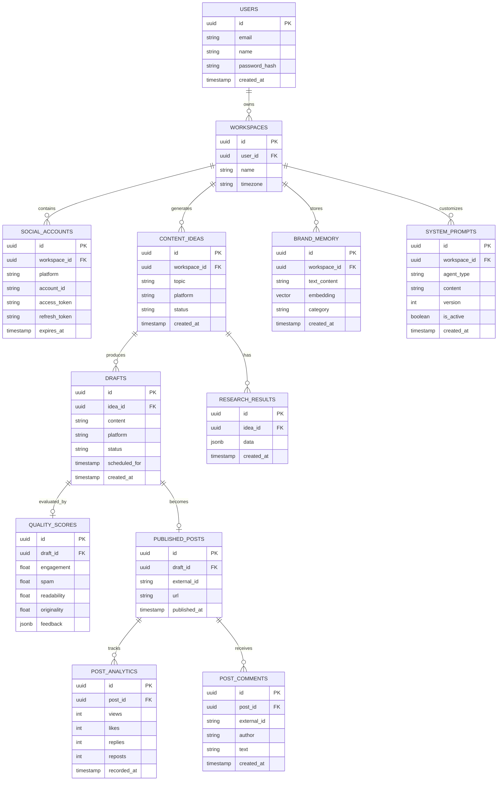

```mermaid
erDiagram
    USERS ||--o{ WORKSPACES : owns
    WORKSPACES ||--o{ SOCIAL_ACCOUNTS : contains
    WORKSPACES ||--o{ CONTENT_IDEAS : generates
    WORKSPACES ||--o{ BRAND_MEMORY : stores
    WORKSPACES ||--o{ SYSTEM_PROMPTS : customizes
    
    CONTENT_IDEAS ||--o{ DRAFTS : produces
    CONTENT_IDEAS ||--o{ RESEARCH_RESULTS : has
    
    DRAFTS ||--o| QUALITY_SCORES : evaluated_by
    DRAFTS ||--o| PUBLISHED_POSTS : becomes
    
    PUBLISHED_POSTS ||--o{ POST_ANALYTICS : tracks
    PUBLISHED_POSTS ||--o{ POST_COMMENTS : receives
    
    USERS {
        uuid id PK
        string email
        string name
        string password_hash
        timestamp created_at
    }
    
    WORKSPACES {
        uuid id PK
        uuid user_id FK
        string name
        string timezone
    }
    
    SOCIAL_ACCOUNTS {
        uuid id PK
        uuid workspace_id FK
        string platform
        string account_id
        string access_token
        string refresh_token
        timestamp expires_at
    }
    
    CONTENT_IDEAS {
        uuid id PK
        uuid workspace_id FK
        string topic
        string platform
        string status
        timestamp created_at
    }
    
    RESEARCH_RESULTS {
        uuid id PK
        uuid idea_id FK
        jsonb data
        timestamp created_at
    }
    
    DRAFTS {
        uuid id PK
        uuid idea_id FK
        string content
        string platform
        string status
        timestamp scheduled_for
        timestamp created_at
    }
    
    QUALITY_SCORES {
        uuid id PK
        uuid draft_id FK
        float engagement
        float spam
        float readability
        float originality
        jsonb feedback
    }
    
    PUBLISHED_POSTS {
        uuid id PK
        uuid draft_id FK
        string external_id
        string url
        timestamp published_at
    }
    
    POST_ANALYTICS {
        uuid id PK
        uuid post_id FK
        int views
        int likes
        int replies
        int reposts
        timestamp recorded_at
    }
    
    POST_COMMENTS {
        uuid id PK
        uuid post_id FK
        string external_id
        string author
        string text
        timestamp created_at
    }
    
    BRAND_MEMORY {
        uuid id PK
        uuid workspace_id FK
        string text_content
        vector embedding
        string category
        timestamp created_at
    }
    
    SYSTEM_PROMPTS {
        uuid id PK
        uuid workspace_id FK
        string agent_type
        string content
        int version
        boolean is_active
        timestamp created_at
    }
```
