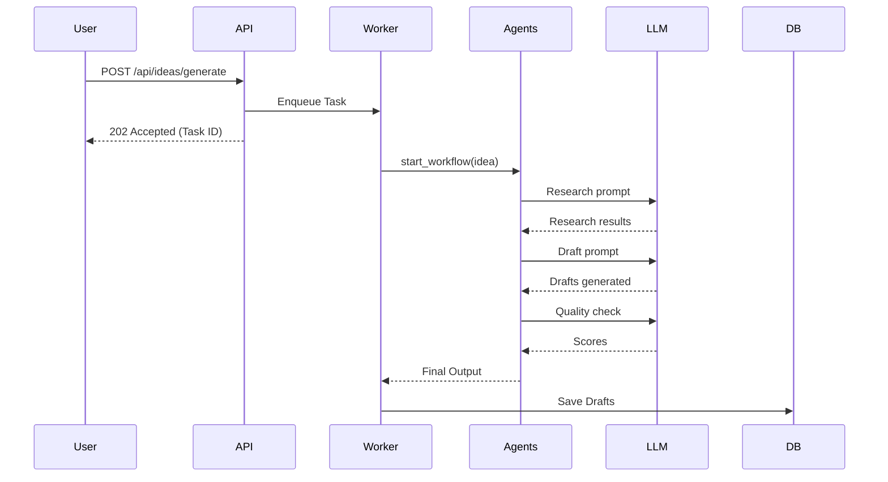

# Architecture Overview

## System Design Decisions

- **Frameworks**: Next.js 14 (App Router) for frontend, FastAPI for backend. Selected for high performance, excellent DX, and robust ecosystem.
- **Database**: PostgreSQL with pgvector. Allows us to combine relational data (users, posts, analytics) with vector embeddings (brand memory, RAG) in a single operational database.
- **Message Broker**: Redis + Dramatiq. Lightweight, reliable background task processing for long-running LLM calls and scheduled social media posts.
- **Multi-Agent System**: We use a graph-based multi-agent architecture where specialized agents (Researcher, Writer, Editor, Quality) coordinate to produce content.

## Data Flow

## Component Responsibilities

1. **API Layer (`/backend/api`)**: Route definitions, request validation, authentication, serialization.
2. **Domain Layer (`/backend/domain`)**: Business logic, Pydantic models, domain services.
3. **Infrastructure (`/backend/infrastructure`)**: Database repositories, external API clients.
4. **Agents (`/backend/agents`)**: LLM orchestration, prompts, multi-agent coordination.
5. **Workers (`/backend/workers`)**: Dramatiq task definitions, scheduler.

## Extension Points

The system is designed to be easily extensible:
- **`LLMProvider` interface**: Swap between OpenAI, Anthropic, local models.
- **`SocialProvider` interface**: Add new platforms easily.
- **Agent Prompts**: Version controlled in the DB, editable via the UI.
